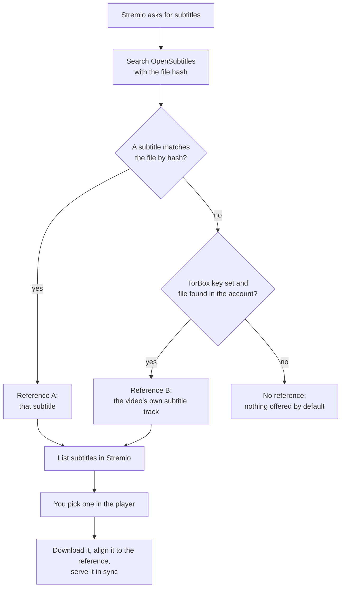

# Stremio Subtitles Sync

**Subtitles that match your exact video file, synced automatically.**

A self-hosted [Stremio](https://www.stremio.com) addon. It finds subtitles on
[OpenSubtitles](https://www.opensubtitles.com), works out how they have to be
shifted to match the file you are playing, and hands Stremio subtitles that are
already in sync. No more pressing the subtitle delay button every few minutes.


## Contents

- [Features](#features)
- [How it works](#how-it-works)
- [Requirements](#requirements)
- [Quick start](#quick-start)
- [Installing the addon in Stremio](#installing-the-addon-in-stremio)
- [Configuration](#configuration)
- [Running as a Windows service](#running-as-a-windows-service)
- [What you see in the player](#what-you-see-in-the-player)
- [Troubleshooting](#troubleshooting)
- [Security and privacy](#security-and-privacy)
- [How it works in depth](#how-it-works-in-depth)
- [Development](#development)
- [Limits](#limits)
- [Disclaimer](#disclaimer)
- [License](#license)

## Features

- **Synced to your file.** Every subtitle is aligned before it reaches the
  player, including a frame rate fix (for example 25 to 23.976 fps) when the
  subtitle drifts.
- **Two sources of truth for timing.** A subtitle that OpenSubtitles has matched
  to your file by hash, or the subtitle track built into the video itself.
- **Works with image subtitles.** PGS and VobSub tracks on Blu-ray remuxes are
  used for their timing, so a remux with no text subtitles still works.
- **Cheap on bandwidth.** For most MKV files the whole subtitle timeline comes
  from the file's seek index: under 1 MB, even for a 55 GB remux.
- **Refuses to guess.** If the match is not convincing, the subtitle is left
  out instead of being shifted to the wrong place.
- **Fits into Stremio's menu.** Subtitles appear under the normal language
  entries ("English", "Polski") next to other addons.
- **Careful with your OpenSubtitles quota.** Nothing is downloaded until you
  pick a subtitle, and downloads are cached.
- **Works on your TV and phone** through your local network.
- **Runs as a Windows service** that starts with your PC.
- **Stateless.** Everything needed to serve a subtitle is in its URL, so the
  server can restart at any time.

## How it works

Stremio never tells a subtitles addon where the stream comes from. An addon only
gets the IMDb id, and for most streams the file name, size and OpenSubtitles
hash. So this addon cannot listen to the audio. Instead it finds a **timing
reference** that is known to match your file, and aligns every subtitle to it.



- **Reference A, a hash-matched subtitle.** OpenSubtitles marks a subtitle as a
  hash match when its uploader had the very same file. Its timing is right by
  definition. Fast, and free of extra traffic.
- **Reference B, the video's own subtitle track.** When OpenSubtitles has never
  seen your file, the addon finds the same file in your
  [TorBox](https://torbox.app) account, proves it is the same file byte for
  byte, and reads the timing of its built-in subtitle track.

The details are in [How it works in depth](#how-it-works-in-depth).

## Requirements

| What | Why |
|---|---|
| [Node.js](https://nodejs.org) 22 or newer | Runs the addon. Tested on Node.js 24. |
| An [OpenSubtitles API key](https://www.opensubtitles.com/consumers) | Search and download subtitles. Free. |
| An OpenSubtitles account (optional, recommended) | A bigger daily download quota than anonymous use. |
| A [TorBox](https://torbox.app) account and API key (optional) | Reference B: sync files that OpenSubtitles does not know. |
| [ffprobe](https://ffmpeg.org) on the PATH (optional) | Reference B: list the video's subtitle tracks. Part of FFmpeg. |
| Windows (optional) | Only for running it as a Windows service. The addon itself runs anywhere Node.js does. |

## Quick start

```bash
git clone <this repository> stremio-subtitles-sync
cd stremio-subtitles-sync
npm install
cp .env.example .env
```

Open `.env` and set at least `OS_API_KEY`. Set `OS_USERNAME` and `OS_PASSWORD`
for a bigger download quota, `LANGUAGES` for the languages you want, and
`TORBOX_API_KEY` if you use TorBox. Then start it:

```bash
npm run dev
```

Check that it runs: <http://127.0.0.1:7000/health> should answer
`{"ok":true,...}`.

## Installing the addon in Stremio

### On the PC that runs the addon

1. Open <http://127.0.0.1:7000/configure>.
2. Leave the key and password fields empty if they are already in `.env`. See
   [Security and privacy](#security-and-privacy) for why.
3. Copy the address from the **Or install by URL** box. Without extra settings
   it is simply `http://127.0.0.1:7000/manifest.json`.
4. In Stremio, open **Addons**, choose to add an addon by URL, and paste it.

Use the address, not the **Install** button. The button creates a `stremio://`
link that some Stremio versions turn into `https` without the port, which cannot
reach a local addon.

### On a TV or phone

The addon runs on your PC. Other devices on the same network can use it:

1. **Let other devices reach the PC.** On Windows, your home network must use
   the **Private** network profile. Windows Firewall blocks Node.js on **Public**
   networks, and a block rule wins over any allow rule. Test it by opening
   `http://<PC address>:7000/health` on your phone.
2. **Give the PC a fixed address** in your router (a DHCP reservation). If the
   address changes, the addon stops working until you install it again.
3. **Install the addon with the PC's network address,** for example
   `http://192.168.1.16:7000/manifest.json`. Stremio syncs installed addons to
   every device on your account.

Stremio's TV and phone apps cannot add an addon by URL, so the install has to
happen on a computer. That is where it gets tricky: Stremio web and the Stremio
desktop app block requests from the web page to addresses on your home network.
Two ways around it:

- **Option 1: a browser.** Install from [web.stremio.com](https://web.stremio.com)
  in Chrome and allow access to your local network when Chrome asks. If it does
  not ask, open `chrome://settings/content/siteDetails?site=https%3A%2F%2Fweb.stremio.com`
  and allow the local network permission there. On the PC itself, keep a second
  install with `http://127.0.0.1:7000/manifest.json` for the desktop app.
- **Option 2: one address for every device.** Use a [nip.io](https://nip.io)
  name, which points to the IP address written in it, for example
  `192.168.1.16.nip.io`. On the PC, point that name at itself by adding this line
  to `C:\Windows\System32\drivers\etc\hosts` as administrator:

  ```
  127.0.0.1 192.168.1.16.nip.io
  ```

  Then run `ipconfig /flushdns`, restart Stremio, and install
  `http://192.168.1.16.nip.io:7000/manifest.json` from the desktop app. The PC
  now reaches the addon through `127.0.0.1`, which the desktop app allows, and
  the TV reaches it through `192.168.1.16`. Some routers block such names
  ("DNS rebind protection"). This option depends on nip.io being available.

Subtitle links always use the address a device connected to, so one install
serves all devices correctly.

## Configuration

Settings come from two places:

- **`.env`**, for your own private instance. This is the recommended place.
- **The `/configure` page**, whose values are packed into the install URL. They
  override `.env` for that install.

Changes to `.env` need a restart of the addon.

| Variable | Default | What it does |
|---|---|---|
| `OS_API_KEY` | | **Required.** OpenSubtitles API key. |
| `OS_USERNAME` | | OpenSubtitles username. Downloads then count against your account's quota. |
| `OS_PASSWORD` | | OpenSubtitles password. Quote it if it holds `#` or a space, see [Troubleshooting](#troubleshooting). |
| `LANGUAGES` | `en` | Languages to offer, comma separated, OpenSubtitles codes, for example `pl,en`. |
| `ANCHOR_LANGUAGES` | `en` | Languages allowed as the timing reference, best first. A complete English subtitle is usually the best reference. |
| `MAX_PER_LANG` | `5` | How many subtitles to offer per language (1 to 20). |
| `INCLUDE_UNSYNCED` | off | Also offer subtitles that could not be synced. |
| `LABELS` | `iso` | `iso` or `verbose`. See [What you see in the player](#what-you-see-in-the-player). |
| `FORMAT` | `srt` | `srt` or `vtt`. |
| `TORBOX_API_KEY` | | Enables reference B. Leave empty to switch it off. |
| `FFPROBE_PATH` | `ffprobe` | Path to ffprobe if it is not on the PATH. |
| `EMBEDDED_WINDOWS` | `6` | Reference B fallback: how many stretches of the file to sample (1 to 20). |
| `EMBEDDED_WINDOW_SECONDS` | `20` | Reference B fallback: length of each stretch (5 to 300). |
| `EMBEDDED_CONCURRENCY` | `2` | Reference B fallback: stretches read at the same time. Set `1` if TorBox answers "429 Too Many Requests". |
| `PORT` | `7000` | Port to listen on. |
| `BASE_URL` | | Public address of the addon, for use behind a proxy. Leave unset on a home network. |
| `LOG_LEVEL` | `info` | `debug`, `info`, `warn` or `error`. |
| `LOG_FILE` | `subtitle-sync.log` | Every log line also goes to this file. `off` writes no file. |
| `EMBEDDED_DUMP_DIR` | | Diagnostics: save references and failed subtitles as JSON in this folder. |

## Running as a Windows service

Run the addon without a terminal window, and start it automatically with
Windows.

1. Stop `npm run dev` if it is running. The service needs the same port.
2. Open PowerShell **as administrator** in the project folder and run:

   ```powershell
   powershell -ExecutionPolicy Bypass -File service\install.ps1
   ```

The script builds the addon, compiles a small service wrapper
(`service/SubtitleSyncService.cs`) with the C# compiler that ships with Windows,
creates the `SubtitleSync` service, starts it, and checks that it answers.
Nothing is downloaded.

| | |
|---|---|
| Start | Automatic, shortly after boot, once the network is up |
| Account | `NT SERVICE\SubtitleSync`, a virtual account with no password |
| Rights | Read access to the project folder, write access only to `logs\` |
| On a crash | The wrapper starts Node.js again, waiting longer after each crash in a row |
| On stop | Node.js and any ffprobe it started are ended together with the service |
| Logs | `logs\subtitle-sync.log` for the addon, `logs\service.log` for the wrapper |

- **After an update:** run `service\install.ps1` again. It rebuilds and restarts
  the service.
- **To remove it:** run `service\uninstall.ps1` the same way. It also removes the
  folder permissions it granted.
- **Service commands:** `Get-Service SubtitleSync`, and in an administrator
  PowerShell `Restart-Service SubtitleSync`.

## What you see in the player

By default each subtitle carries a plain language code (`eng`, `pol`), so Stremio
lists it under its normal language entry, next to subtitles from other addons.

With `LABELS=verbose` the label says how the subtitle was synced instead:

| Label | Meaning |
|---|---|
| `English - exact match` | OpenSubtitles matched this subtitle to your file by hash. Served as uploaded. |
| `English - auto-synced` | Aligned to a hash-matched subtitle. |
| `English - synced to the video` | Aligned to the video's own subtitle track. |
| `English - auto-synced, weak reference` | Aligned to a subtitle whose release name matches your file name. Only a guess. |
| `English - not synced` | Nothing to align to. Only shown with `INCLUDE_UNSYNCED`. |

Stremio shows each different label as a language entry of its own, so verbose
labels do not appear under "English".

Subtitles are listed in this order: exact matches first, then the rest by
quality (downloads, rating, trusted uploader). Machine-translated subtitles come
last.

## Troubleshooting

**Check the log first.** Every request is logged with its status and time, in
the terminal and in `subtitle-sync.log` (`logs\subtitle-sync.log` for the
service). Every served subtitle also carries an `X-Subtitle-Sync` response
header with the offset, frame rate ratio and match strength.

| Problem | Cause and fix |
|---|---|
| No subtitles from this addon in the menu | Look for a `tt...: hash ..., size ..., filename ...` line in the log. **No line:** Stremio never asked, see the rows below. **All "no":** your stream addon sends no file details, so there is nothing to find the file by. Try another stream. **Line present but 0 subtitles offered:** no reference was found, see [Limits](#limits). |
| Subtitles are listed under their own entries, not "English" | The install still uses `labels=verbose`. Settings from `/configure` live in the install URL, so remove the addon and install it again. |
| Stremio web: `Permission was denied for this request to access the loopback address space` | Chrome blocks web.stremio.com from calling your own PC. Allow the local network permission for the site in Chrome's site settings. |
| `Failed to get addon manifest ... Failed to fetch` when adding the addon | The Stremio app blocked the request to a home network address, so it never reached the addon. Use one of the two options in [On a TV or phone](#on-a-tv-or-phone). |
| The TV or phone cannot reach the addon | Open `http://<PC address>:7000/health` on the phone. If it fails, set your home network to the Private profile in Windows. |
| `Failed to load external subtitles` | The log shows why. `429 Too Many Requests` means TorBox refused reads while you stream from it: try again a minute later, or set `EMBEDDED_CONCURRENCY=1`. `client closed the connection` means the first sync took longer than the player waits (about 10 seconds), which happens when a file has no usable index. Pick the subtitle again once the log shows the reference was read. |
| `No confident alignment` in the log | The reference and the subtitle do not match well enough, or the reference is too thin. The subtitle is refused on purpose rather than shifted to a wrong place. Try another subtitle. |
| OpenSubtitles login fails with 401 while the password is right | Node.js cuts a value in `.env` at an unquoted `#`. Write it as `OS_PASSWORD="pa#ssword"`. |
| `download quota remaining: 0` | The daily OpenSubtitles quota is used up. Log in with an account, or wait until the next day. |

## Security and privacy

- **Keep keys in `.env`, not on the configure page.** Anything typed into
  `/configure` becomes part of the install URL, passwords and API keys included.
  That URL is stored in your Stremio account and appears in logs and
  screenshots. With keys in `.env`, the install URL holds no secrets.
- **Anyone who can reach the addon can use your keys.** It has no login. On a
  home network that is usually fine. Do not expose the port to the internet
  without putting authentication in front of it.
- **Logs hide secrets.** The config part of request URLs is written as
  `<config>`, and TorBox download links are cut before their token.
- **The Windows service runs with minimal rights**, as its own virtual account
  that can only read the project and write its logs.
- **What leaves your network:** searches and downloads to OpenSubtitles, and,
  with a TorBox key, account listings and small range reads of your own files
  to TorBox.

## How it works in depth

### What Stremio tells an addon

| Field | Example |
|---|---|
| `type` | `movie` or `series` |
| `id` | `tt0780504`, or `tt0944947:3:9` for an episode |
| `extra.videoHash` | `68aa45ea875df15c` (OpenSubtitles file hash) |
| `extra.videoSize` | `54744830678` |
| `extra.filename` | `Drive.2011.UHD.BluRay.2160p.TrueHD.Atmos.7.1.DV.HEVC.REMUX-FraMeSToR.mkv` |

That is the complete list (`subtitles_update` in stremio-core's
`src/models/player.rs`). There is no way for an addon to read the stream
([stremio-core#965](https://github.com/Stremio/stremio-core/issues/965)).

### Reference A: a hash-matched subtitle

OpenSubtitles marks each search result with `moviehash_match`. When it is true,
the uploader had this exact file, so the subtitle's timing is right by
construction. It becomes the anchor, and every other subtitle is aligned to it.
It costs two small downloads the first time and about a second.

If no subtitle matches by hash, a subtitle whose release name closely matches
the file name is used as a weaker anchor.

### Reference B: the video's own subtitle track

1. **Find the file.** List the TorBox account and match on the OpenSubtitles
   hash that TorBox stores per file, or on the exact byte size.
2. **Prove it is the same file.** When TorBox has no hash, fetch the first and
   last 64 KiB and compute the hash. 128 KiB settles it before anything
   expensive happens.
3. **Pick a subtitle track.** Read the container header. Forced tracks are
   skipped, because they only cover foreign-language lines. Text tracks come
   before image tracks, then the preferred anchor languages.
4. **Read the file's index.** A Matroska file from MKVToolNix or FFmpeg lists
   every subtitle packet in its seek index (the Cues element). A few hundred KB
   near the end of the file give the timing of every line in the film. PGS
   subtitles store each line as two events, one that shows the image and one
   that clears it, so those are paired back into lines.
5. **Sample it, if there is no usable index.** Read short stretches spread
   across the film with ffprobe, and keep only the packet timestamps.

Nothing is decoded. Only packet timings are read, so image subtitles (PGS,
VobSub) work as well as text. The addon needs to know when someone spoke, never
what they said.

**Why the index matters.** On a 55 GB remux of *Drive*, whose only subtitles are
PGS images, the index gave all 692 lines in half a second from 857 KB. Sampling
six 20-second stretches took 68 seconds, read several gigabytes, and found only
16 events: *Drive* has about one line every nine seconds, so most stretches held
nothing.

**What sampling costs** when a file has no usable index. The traffic is roughly
total seconds sampled times the bitrate, paid once per file and cached for a
day:

| File | Six 20-second stretches |
|---|---|
| 2 GB, 2.2 Mbps | about 30 MB |
| 10 GB, 11 Mbps | about 150 MB |
| 20 GB remux, 22 Mbps | about 330 MB |

Lessons from real files that shaped the sampling:

- **ffprobe does not stop at the end of a stretch.** If the track has no packet
  in it, ffprobe reads on until it finds one, which on a sparse track means
  streaming most of the file. So each stretch is a separate ffprobe with its own
  timeout, and anything past the stretch is dropped.
- **Debrid links allow only a couple of connections.** Stretches are read two at
  a time. After a `429 Too Many Requests` the rest go one at a time, and a
  refused read is retried after a pause instead of counting as "no subtitles".
- **Anime tracks mix karaoke with dialogue.** An opening song can produce 144
  overlapping events in 12 seconds, which matches any shift equally well. Such
  stretches (over three events a second, or over 90% covered) are dropped.

### Alignment

Both subtitles are turned into a "someone is talking" timeline, and one is slid
over the other until the overlap peaks. It is the same idea as
[ffsubsync](https://github.com/smacke/ffsubsync), but the reference is a
subtitle instead of the audio, so no video has to be decoded. Common frame rate
ratios are tried too (25 to 23.976 and others), which fixes subtitles that drift
instead of being late by a fixed amount.

**Why overlap alone is not enough.** The winning shift is the best of about a
thousand tried, and the best of a thousand coin flips always looks good. An
early version matched two unrelated films at 0.79 overlap. So the aligner also
measures how far the winning shift stands above all the other shifts, in
standard deviations. A real match stands far above the rest, a lucky one does
not. Both checks must pass before any timing is changed.

### Subtitle URLs

The addon keeps no state between listing subtitles and serving one. Each URL
describes the whole job:

```
/<config>/s/<fileId>.<lang>/<name>.srt                      serve as uploaded
/<config>/x/<anchorId>.<lang>/<fileId>.<lang>/<name>.srt    align to a subtitle
/<config>/f/<videoHint>/<fileId>.<lang>/<name>.srt          align to the video
```

`<config>` is `_` when everything comes from `.env`.

### OpenSubtitles quota

Searching is free. Downloading is limited per day, so:

- Nothing is downloaded while the subtitle list is built. A download happens
  only when you pick a subtitle.
- A subtitle aligned to reference A costs two downloads the first time (the
  anchor and the subtitle). The anchor is cached, so later picks for the same
  video cost one.
- Reference B costs no OpenSubtitles quota for the reference, only TorBox
  traffic.

## Development

```bash
npm run dev          # run with automatic reload on code changes
npm test             # unit and end-to-end tests (end-to-end ones need ffmpeg)
npm run typecheck    # type check only
npm run build        # compile to dist/
npm start            # run the compiled server
```

### Project layout

```
src/
  index.ts              Express app: request log, CORS, routes
  manifest.ts           Addon manifest and the /configure form
  landing.ts            Adds a copy-paste install URL to the SDK's page
  addon.ts              Subtitles handler: search, pick a reference, build URLs
  picker.ts             Anchor selection and candidate ranking
  config.ts             Settings from .env and from the install URL
  context.ts            Request address for building subtitle links
  urls.ts               Builds and parses the subtitle URLs
  log.ts                Logging to the terminal and a file
  opensubtitles/
    client.ts           REST client: login, search, download, encoding fallback
  sources/
    match.ts            Which file in an account is the one being played
    torbox.ts           TorBox account listing and download links
  embedded/
    oshash.ts           OpenSubtitles hash from two range requests
    mkvcues.ts          Subtitle timings from the Matroska seek index
    ffprobe.ts          Track listing and sampled packet timings
    reference.ts        Find the file, prove it, read or sample it, cache it
  subtitles/
    parse.ts            SRT, WebVTT and ASS to cues
    serialize.ts        Cues back to SRT or WebVTT
    align.ts            The alignment algorithm
  routes/
    subtitles.ts        Serves a subtitle as uploaded or aligned
service/
  SubtitleSyncService.cs  Windows service wrapper
  install.ps1             Builds and installs the service
  uninstall.ps1           Removes the service
scripts/                  Diagnostics against live accounts
test/                     Unit and end-to-end tests
```

### Diagnostics

These scripts check the live path against your own accounts. None of them print
an API key or a signed link.

```bash
npm run check:torbox     # account listing, hash cross-check, track listing
npm run check:tracks     # subtitle tracks of files in the account (header reads only)
npm run check:extract    # a real sampled read, with events per stretch
npx tsx scripts/align-debug.ts ref.json target.json   # why an alignment failed
```

Set `EMBEDDED_DUMP_DIR` to save references and failed subtitles as JSON, so a
failed alignment can be examined without reading the file again. `align-debug`
reads those files.

## Limits

- **Reference A** depends on OpenSubtitles knowing your file's hash. Rare or new
  releases often have no hash match.
- **Reference B** needs the file in your TorBox account, with a subtitle track
  that is not forced-only. Many releases have none.
- **The fast index read is for MKV files.** MP4 files, and MKV files whose index
  does not list subtitles, fall back to sampling. On quiet films sampling may
  find too little to sync.
- **The first sync of a large file without an index can take longer** than the
  player waits. Picking the subtitle again works once the reference is cached.
- **Both files must be the same cut.** An extended cut aligned to a theatrical
  subtitle matches at the start and drifts later.
- **One shift per subtitle.** Alignment is a single offset plus an optional
  frame rate ratio. It cannot fix a subtitle that needs different offsets in
  different scenes.
- **Very dense subtitles are hard to align.** When a subtitle is on screen most
  of the time, every shift overlaps about equally, and the addon refuses rather
  than guesses.
- **Stremio web and desktop block home network addresses.** See
  [On a TV or phone](#on-a-tv-or-phone) for the workarounds.

## Disclaimer

This is an independent project. It is not affiliated with, endorsed by, or
connected to Stremio, OpenSubtitles or TorBox. You are responsible for following
the terms of the services you use it with.

## Acknowledgements

- [Stremio addon SDK](https://github.com/Stremio/stremio-addon-sdk)
- [OpenSubtitles REST API](https://opensubtitles.stoplight.io)
- [ffsubsync](https://github.com/smacke/ffsubsync), for the alignment idea
- [FFmpeg](https://ffmpeg.org), for ffprobe

## License

[MIT](LICENSE)
